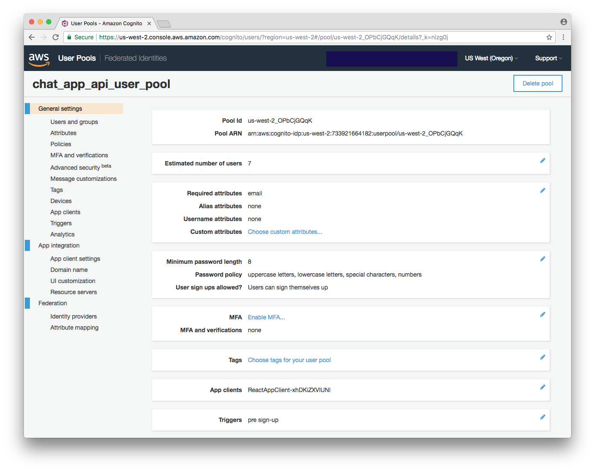
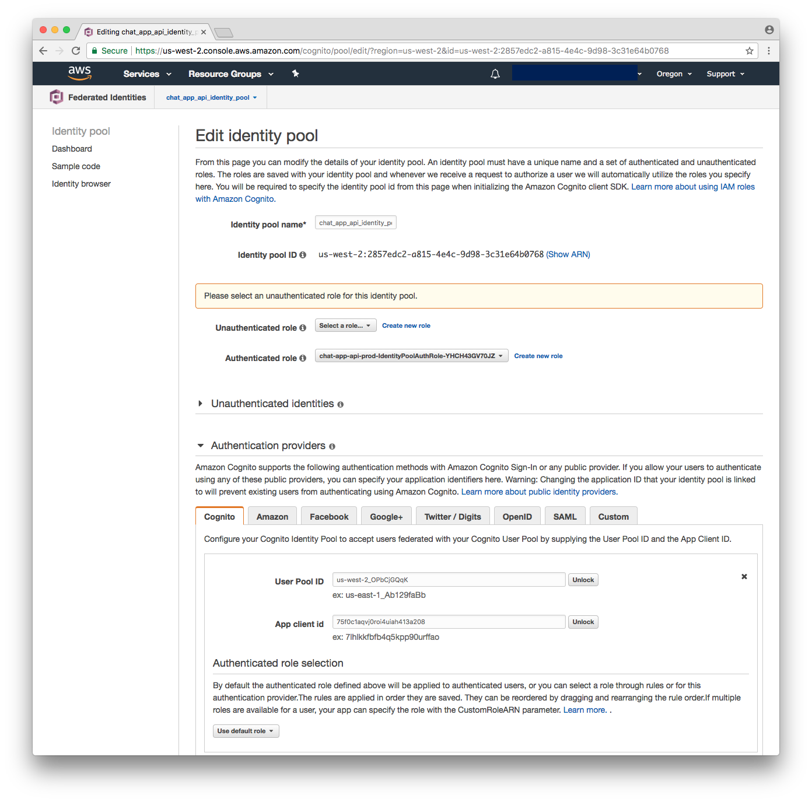

# Authentication

First off, we need to create a user pool which will maintain the directory of our users.

```diff
# api/serverless.yml
resources:
  Resources:
+   UserPool:
+     Type: "AWS::Cognito::UserPool"
+     Properties:
+       UserPoolName: chat_app_api_user_pool
+       AutoVerifiedAttributes:
+         - email
+       MfaConfiguration: OFF
+       Schema:
+         - AttributeDataType: String
+           Name: email
+           Required: true
```

Next, we need to create a user pool client for our React application.

```diff
# api/serverless.yml
resources:
  Resources:
+   ReactAppClient:
+     Type: AWS::Cognito::UserPoolClient
+     Properties:
+       GenerateSecret: false
+       RefreshTokenValidity: 200
+       UserPoolId:
+         Ref: UserPool
```

Next, we need to create an identity pool. See [Social Logins Guide](social_logins.md) to configure Facebook and Google app ids.

```diff
# api/serverless.yml
resources:
  Resources:
+   IdentityPool:
+     Type: "AWS::Cognito::IdentityPool"
+     Properties:
+       IdentityPoolName: chat_app_api_identity_pool
+       AllowUnauthenticatedIdentities: false
+       CognitoIdentityProviders:
+         - ClientId:
+             Ref: ReactAppClient
+           ProviderName:
+             Fn::GetAtt: UserPool.ProviderName
+       SupportedLoginProviders:
+         graph.facebook.com: ${self:custom.variables.facebook_app_id}
+         accounts.google.com: ${self:custom.variables.google_app_id}
```

Now we need to create the IAM role that users will be granted when authenticated with the identity pool. This role will need to have access to the AWS IoT data plane and the created API.

```diff
# api/serverless.yml
resources:
  Resources:
+   IdentityPoolAuthRole:
+     Type: "AWS::IAM::Role"
+     Properties:
+       AssumeRolePolicyDocument:
+         Version: "2012-10-17"
+         Statement:
+           - Effect: "Allow"
+             Principal:
+               Federated:
+                 - "cognito-identity.amazonaws.com"
+             Action:
+               - "sts:AssumeRoleWithWebIdentity"
+             Condition:
+               StringEquals:
+                 cognito-identity.amazonaws.com:aud:
+                   Ref: IdentityPool
+               ForAnyValue:StringLike:
+                 cognito-identity.amazonaws.com:amr: authenticated
+       ManagedPolicyArns:
+         - arn:aws:iam::aws:policy/AWSIoTDataAccess
+       Path: "/"
+       Policies:
+         - PolicyName: invoke-api-gateway
+           PolicyDocument:
+             Version: '2012-10-17'
+             Statement:
+               - Effect: Allow
+                 Action:
+                   - execute-api:Invoke
+                 Resource: { "Fn::Join" : ["", ["arn:aws:execute-api:",{"Ref":"AWS::Region"},":",{"Ref":"AWS::AccountId"},":",{"Ref":"ApiGatewayRestApi"},"/*"]] }
```

Attaching the role to the identity pool:

```diff
# api/serverless.yml
resources:
  Resources:
+   IdentityPoolRoleAttachment:
+     Type: AWS::Cognito::IdentityPoolRoleAttachment
+     Properties:
+       IdentityPoolId:
+         Ref: IdentityPool
+       Roles:
+         authenticated:
+           Fn::GetAtt:
+             - IdentityPoolAuthRole
+             - Arn
```

Amazon Cognito User Pools require a user confirmation flow prior to logging in. This project skips this flow by using a Lambda function and a Cognito PreSignUp trigger. To see how this is accomplished, see [Auto Confirming Users Guide](auto_confirming_users.md)

Assuming everything is configured correctly, after running `serverless deploy` and navigating to the User Pools page of the AWS console, you should see something like:



Similarly, if you navigate to the identity pool in the Federated Identities dashboard of the AWS console and click on "Edit identity pool", you should see a page that is configured:



According to the [Policies for HTTP and WebSocketClients](http://docs.aws.amazon.com/iot/latest/developerguide/pub-sub-policy.html#pub-sub-policy-cognito) documentation, in order to authenticate an Amazon Cognito identity to publish MQTT messages over HTTP, you must specify two policies. The first policy must be attached to an Amazon Cognito identity pool role. This is the managed policy `AWSIoTDataAccess` that was defined earlier in the `IdentityPoolAuthRole`.

The second policy must be attached to an Amazon Cognito user using the [AWS IoT AttachPrincipalPolicy API](http://docs.aws.amazon.com//iot/latest/apireference/API_AttachPrincipalPolicy.html).

To accomplish this, we will use Lambda functions to attach these policies after a user has logged in.

We first define our IoT Policy resources in our CloudFormation/Serverless template:

```diff
# api/serverless.yml
resources:
  Resources:
+   ConnectPolicy:
+     Type: "AWS::IoT::Policy"
+     Properties:
+       PolicyName: ConnectPolicy
+       PolicyDocument:
+         Version: "2012-10-17"
+         Statement:
+         - Effect: "Allow"
+           Action:
+             - "iot:Connect"
+           Resource:
+             - "*"

+   PublicSubscribePolicy:
+     Type: "AWS::IoT::Policy"
+     Properties:
+       PolicyName: PublicSubscribePolicy
+       PolicyDocument:
+         Version: "2012-10-17"
+         Statement:
+         - Effect: "Allow"
+           Action:
+             - "iot:Subscribe"
+           Resource: { "Fn::Join" : ["",["arn:aws:iot:",{"Ref":"AWS::Region"},":",{"Ref":"AWS::AccountId"},":topicfilter/room/public/*"]] }

+   PublicReceivePolicy:
+     Type: "AWS::IoT::Policy"
+     Properties:
+       PolicyName: PublicReceivePolicy
+       PolicyDocument:
+         Version: "2012-10-17"
+         Statement:
+         - Effect: "Allow"
+           Action:
+             - "iot:Receive"
+           Resource: { "Fn::Join" : ["",["arn:aws:iot:",{"Ref":"AWS::Region"},":",{"Ref":"AWS::AccountId"},":topic/room/public/*"]] }
```

These policies allow users to connect to IoT and subscribe/receive from the topic `/room/public/*`.

Unlike these three static policies, the publishing policy is more dynamic. See `api/src/policy/attachPublicPublish.js` to see how it is implemented. Also see [Chat App IoT Topic Explanation](iot_topics.md) for an explanation of the topic space used for this application.

The corresponding Lambda functions take on the form:

```js
// See api/src/policy/attachConnect.js
import AWS from 'aws-sdk';

export const main = async (event, context, callback) => {
	const principal = event.requestContext.identity.cognitoIdentityId;
	const policyName = 'ConnectPolicy';

	const iot = new AWS.Iot();
	await iot.attachPrincipalPolicy({ principal, policyName }).promise();
	callback(null, "success");
};
```

After running `serverless deploy` and `./client/scripts/setup.sh`, the file `client/src/config/congig.json` should be generated with the appropriate variables retrieved from CloudFormation.

The backend is now set up. :tada: :tada: :tada:

Now for the frontend.

Registering a user is straight forward using [Amazon Cognito Identity SDK for JavaScript](https://github.com/aws/amazon-cognito-identity-js)


```js
import { CognitoUserPool, CognitoUserAttribute } from 'amazon-cognito-identity-js';
import Config from './config';

const userPool = new CognitoUserPool({
  UserPoolId: Config.awsCognitoUserPoolId,
  ClientId: Config.awsCognitoUserPoolAppClientId,
});

const username = 'username';
const email = 'test@test.com';
const password = 'password';

const attributeList = [];
const attributeEmail = new CognitoUserAttribute({ Name: 'email', Value: email });

attributeList.push(attributeEmail);

userPool.signUp(username, password, attributeList, null, (err, data) => {
	if (err) {
		alert(err);
		return;
	}
	console.log(result.user);
});
```

Likewise, logging in:

```js
import { CognitoUserPool, CognitoUser } from 'amazon-cognito-identity-js';
import Config from './config';

const userPool = new CognitoUserPool({
  UserPoolId: Config.awsCognitoUserPoolId,
  ClientId: Config.awsCognitoUserPoolAppClientId,
});

const username = 'username';
const password = 'password';

const authenticationDetails = new AuthenticationDetails({
	Username: username,
	Password: password,
});

const cognitoUser = new CognitoUser({
	Username: username,
	Pool: userPool,
});

cognitoUser.authenticateUser(authenticationDetails, {
	onSuccess: (cognitoUserSession) => {
		console.log(cognitoUserSession);
	},
	onFailure: (err) => {
		alert(err);
  },
})
```

With the `cognitoUserSession`, we can retrieve AWS credentials.

```js
import Config from './config';

const jwtToken = cognitoUserSession.getIdToken().getJwtToken();

const providerKey = `cognito-idp.${Config.awsRegion}.amazonaws.com/${Config.awsCognitoUserPoolId}`;

AWS.config.region = Config.awsRegion;

AWS.config.credentials = new AWS.CognitoIdentityCredentials({
	IdentityPoolId: Config.awsCognitoIdentityPoolId,
	Logins: {
		[providerKey]: token,
	},
});

AWS.config.credentials.get((error) => {
	if (error) {
		alert(error);
		return;
	}

	const { accessKeyId, secretAccessKey, sessionToken } = AWS.config.credentials;

	console.log(AWS.config.credentials);
});
```

Similarly at this step, if we are authenticating with a third party provider such as Facebook or Google, we can replace the `providerKey` with `graph.facebook.com` or `accounts.google.com` and then use the appropriate access token.

The final step is to attach these AWS credentials to our MQTT and API Gateway clients. Let us start with our IoT MQTT device.

```js
import DeviceSdk from 'aws-iot-device-sdk';
import Config from './config';

const { accessKeyId, secretAccessKey, sessionToken } = AWS.config.credentials;

const client = DeviceSdk.device({
	region: Config.awsRegion,
	host: Config.awsIotHost,
	clientId: `${Math.floor((Math.random() * 1000000) + 1)}`,
	protocol: 'wss',
	accessKeyId: accessKeyId,
	secretKey: secretAccessKey, // NOTE the difference in variable names https://github.com/aws/aws-iot-device-sdk-js/issues/166
	sessionToken: sessionToken,
});
```

Now this device won't be able to connect to AWS IoT yet because it only has the identity role policy attached. It still needs to acquire the IoT Connect policy. Let us grab this by invoking the Lambda function we created earlier.

A `SigV4` client is provided in `client/src/lib/sigV4Client.js` to make authenticated AWS requests.

```js
import AWS from 'aws-sdk';
import Config from '../config';
import sigV4Client from './sigV4Client';

export const invokeAPIGateway = async ({
  path,
  method = 'GET',
  headers = {},
  queryParams = {},
  body,
}) => {
  const client = sigV4Client.newClient({
    accessKey: AWS.config.credentials.accessKeyId,
    secretKey: AWS.config.credentials.secretAccessKey,
    sessionToken: AWS.config.credentials.sessionToken,
    region: Config.awsRegion,
    endpoint: Config.awsApiGatewayInvokeUrl,
  });

  const signedRequest = client.signRequest({
    method,
    path,
    headers,
    queryParams,
    body,
  });

  const signedBody = body ? JSON.stringify(body) : body;
  const signedHeaders = signedRequest.headers;

  const results = await fetch(signedRequest.url, {
    method,
    headers: signedHeaders,
    body: signedBody,
  });

  if (results.status !== 200) {
    throw new Error(await results.text());
  }

  return results.json();
};

export const attachConnectPolicy = async () => {
  try {
    await invokeAPIGateway({
      path: '/policy/attach_connect',
      method: 'POST',
      body: {},
    });
  } catch (error) {
    log.error(error);
  }
};
```

Done! Upon successful invocation, the user's identity will have both the IAM policy and IoT policy allowing it to connect to AWS IoT using MQTT over the WebSocket protocol. See `client/src/lib/api-gateway.js` to see the rest of the Lambda functions.

